# Croupier

Croupier is a smart task definition and execution library, which
can be used for [dataflow programming](https://en.wikipedia.org/wiki/Dataflow_programming).

[](https://ralsina.github.io/croupier/)
[](https://github.com/ralsina/croupier/blob/main/LICENSE)
[](https://GitHub.com/ralsina/croupier/releases/)
[](https://ralsina.me/categories/croupier.html)

[](https://github.com/ralsina/croupier/actions/workflows/ci.yml)
[](https://codecov.io/gh/ralsina/croupier)
[](https://github.com/ralsina/croupier/actions/workflows/mutation.yml)

## What does it mean

You use Croupier to define tasks. Tasks have:

* An id
* Zero or more input files or k/v store keys
* Zero or more output files or k/v store keys
* A `Proc` that consumes the inputs and returns a string
* After the `Proc` returns data which is saved to the output(s)
  unless the task has the `no_save` flag set to `true`, in which
  case it's expected to have already saved it.

  **Note:** the return value for procs depends on several factors, see below.
  **Note:** A reference to a k/v key is of the form `kv://mykey`

And here is the fun part:

Croupier will examine the inputs and outputs for your tasks and
use them to build a dependency graph. This expresses the connections
between your tasks and the files on disk, and between tasks, and **will
use that information to decide what to run**.

So, suppose you have `task1` consuming `input.txt` producing
`fileA` and `task2` that has `fileA` as input and outputs `fileB`.
That means your tasks look something like this:

```mermaid
  graph LR;
      id1(["📁 input.txt"])-->idt1["⚙️ task1"]-->id2(["📁 fileA"]);
      id2-->idt2["⚙️ task2"]-->id3(["📁 fileB"]);
```



Croupier guarantees the following:

* If `task1` has never run before, it *will run* and create `fileA`
* If `task1` has run before and `input.txt` has not changed, it *will not run*.
* If `task1` has run before and ìnput.txt` has changed, it *will run*
* If `task1` runs, `task2` *will run* and create `fileB`
* `task1` will run *before* `task2`

That's a very long way to say: Croupier will run whatever needs
running, based on the content of the dependency files and the
dependencies between tasks. In this example it may look silly
because it's simple, but it should work even for thousands of
tasks and dependencies.

The state between runs is kept in `.croupier` so if you delete
that file all tasks will run.

Further documentation at the [doc pages](https://ralsina.github.io/croupier/)

### Notes

### Notes about proc return types

* Procs in Tasks without outputs can return nil or a string,
  it will be ignored.

* Procs with one output and `no_save==false` should return a
  string which will be saved to that output.

  If `no_save==true` then the returned value is ignored.

* Procs with multiple outputs and `no_save==false` should
  return an `Array(String)` which will be saved to those outputs.

  If `no_save==true` then the returned value is ignored.

### No target conflicts

If there are two or more tasks with the same output they will be
merged into the first task created. The resulting task will:

* Depend on the combination of all dependencies of all merged tasks
* Run the procs of all merged tasks in order of creation

### Tasks without output

A task with no output will be registered under its `id` and is not expected
to create any output files. Other than that, it's just a regular task.

### Tasks with multiple outputs

If a task expects the TaskManager to create multiple files, it
should return an array of strings.

## Installation

1. Add the dependency to your `shard.yml`:

   ```yaml
   dependencies:
     croupier:
       github: ralsina/croupier
   ```

2. Run `shards install`

## Usage

This is the example described above, in actual code:

```crystal
require "croupier"

Croupier::Task.new(
  output: "fileA",
  inputs: ["input.txt"],
) {
  puts "task1 running"
  File.read("input.txt").downcase
}

Croupier::Task.new(
  output: "fileB",
  inputs: ["fileA"],
) do
  puts "task2 running"
  File.read("fileA").upcase
end

Croupier::Task.run_tasks
```

If we create a `index.txt` file with some text in it and run this
program, it will print it's running `task1` and `task2` and
produce `fileA` with that same text in upper case, and `fileB`
with the text in lowercase.

The second time we run it, it will *do nothing* because all tasks
dependencies are unchanged.

If we modify `index.txt` or `fileA` then one or both tasks
will run, as needed.

## Auto Mode

Besides `run_tasks`, there is another way to run your tasks,
`auto_run`. It will run tasks as needed, when their input
files change. This allows for some sorts of "continuous build"
which is useful for things like web development.

You start the auto mode with `TaskManager.auto_run` and stop
it with `TaskManager.auto_stop`. It runs in a separate fiber
so your main fiber needs to do something else and yield. For
details on that, see [Crystal's docs.](https://crystal-lang.org/reference/1.8/guides/concurrency.html)

This feature is still under development and may change, but here
is an example of how it works, taken from the specs:

```crystal
# We create a proc that has a visible side effect
x = 0
counter = TaskProc.new { x += 1; x.to_s }
# This task depends on a file called "i" and produces "t1"
Task.new(output: "t1", inputs: ["i"], proc: counter)
# Launch in auto mode
TaskManager.auto_run

# We have to yield and/or do stuff in the main fiber
# so the auto_run fibers can run
Fiber.yield

# Trigger a build by creating the dependency
File.open("i", "w") << "foo"
Fiber.yield

# Stop the auto_run
TaskManager.auto_stop

# It should only have ran once
x.should eq 1
File.exists?("t1").should eq true
```

## Development

Let's try to keep test coverage good :-)

* To run tests: `make test` or `crystal spec`
* To check coverage: `make coverage`
* To run mutation testing: `make mutation`

Other than that, anything is fair game. In the TODO.md file there is a
section for things that were considered and decided to be a bad idea,
but that is conditional and can change when presented with a good
argument.

## Contributing

1. Fork it (<https://github.com/ralsina/croupier/fork>)
2. Create your feature branch (`git checkout -b my-new-feature`)
3. Commit your changes (`git commit -am 'Add some feature'`)
4. Push to the branch (`git push origin my-new-feature`)
5. Create a new Pull Request

## Contributors

* [Roberto Alsina](https://github.com/ralsina) - creator and maintainer
