# Croupier

Croupier is a smart task definition and execution library, which can be used for [dataflow programming](https://en.wikipedia.org/wiki/Dataflow_programming).

[](https://ralsina.github.io/croupier/)
[](https://github.com/ralsina/croupier/blob/main/LICENSE)
[](https://GitHub.com/ralsina/croupier/releases/)
[](https://ralsina.me/categories/croupier.html)


[](https://github.com/ralsina/croupier/actions/workflows/ci.yml)
[](https://codecov.io/gh/ralsina/croupier)
[](https://github.com/ralsina/croupier/actions/workflows/mutation.yml)

## What does that mean?

You use Croupier to define tasks. Tasks have:

* A name
* Zero or more input files
* Zero or more output files
* A `Proc` that consumes the inputs and returns a string
* After the `Proc` returns a string it's saved to the output unless
  the task has the `no_save` flag set to `true`, in which case it's expected to have already saved it.

  **Note:** if a task has multiple outputs, read below for an explanation

And here is the fun part:

Croupier will examine the inputs and outputs for your tasks and
use them to build a dependency graph. This expresses the connections
between your tasks and the files on disk, and between tasks, and **will 
use that information to decide what to run**.

So, suppose you have `task1` consuming `input.txt` producing `fileA` and `task2` that has `fileA` as input and outputs `fileB`. That means your tasks look something like this:

```mermaid
  graph LR;
      id1(["📁 input.txt"])-->idt1["⚙️ task1"]-->id2(["📁 fileA"]);
      id2-->idt2["⚙️ task2"]-->id3(["📁 fileB"]);
```



Croupier guarantees the following:

* If `task1` has never run before, it *will run* and create `fileA`
* If `task1` has run before and `input.txt` has not changed, it *will not run*.
* If `task1` has run before and ìnput.txt` has changed, it *will run*
* If `task1` runs, `task2` *will run* and create `fileB`
* `task1` will run *before* `task2`

That's a very long way to say: Croupier will run whatever needs running, based on the content of the dependency files and the dependencies between tasks. In this example it may look silly because it's simple, but it should work even for thousands of tasks and dependencies.

The state between runs is kept in `.croupier` so if you delete that file
all tasks will run.

Further documentation at the [doc pages](https://ralsina.github.io/croupier/)

### Notes

**Notes about procs and multiple outputs**

For tasks with `no_save == false`

* If a task has no output, its proc should return a string, which is ignored.
* If a task has one output, its proc should return a string, which is saved into the output file
* If a task has multiple outputs, its proc should return a string which when parsed as YAML is an array of strings, which will be saved in their respective outputs in order.
  
For tasks with `no_save == true`

The proc should return a string, which will be ignored. However, TaskManager will check that the outputs exist and are readable.

**No target conflicts**

If there are two or more tasks with the same output they will be merged into the first task created. The resulting task will:
 
* Depend on the combination of all dependencies of all merged tasks
* Run the procs of all merged tasks in order of creation

**Tasks without output**

A task with no output will be registered under output "" and is not expected
to create any output files. Other than that, it's just a regular task.

**Tasks with multiple outputs**

If a task expects the TaskManager to create multiple files, it
should return a YAML-encoded array of strings.

This will change soonish.

## Installation

1. Add the dependency to your `shard.yml`:

   ```yaml
   dependencies:
     croupier:
       github: your-github-user/croupier
   ```

2. Run `shards install`

## Usage

This is the example described above, in actual code:

```crystal
require "croupier"

b1 = ->{
  puts "task1 running"
  File.read("input.txt").downcase
}

Croupier::Task.new(
  name: "task1",
  output: "fileA",
  inputs: ["input.txt"],
  proc: b1
)

b2 = ->{
  puts "task2 running"
  File.read("fileA").upcase
}
Croupier::Task.new(
  name: "task2",
  output: "fileB",
  inputs: ["fileA"],
  proc: b2
)

Croupier::Task.run_tasks
```

If we create a `index.txt` file with some text in it and run this program, it will print it's running `task1` and `task2` and produce `fileA` with that same text in upper case, and `fileB` with the text in lowercase.

The second time we run it, it will *do nothing* because all tasks dependencies are unchanged.

If we modify `index.txt` or `fileA` then one or both will tasks will run, as needed.

## Development

Let's try to keep test coverage good :-)

## Contributing

1. Fork it (<https://github.com/your-github-user/croupier/fork>)
2. Create your feature branch (`git checkout -b my-new-feature`)
3. Commit your changes (`git commit -am 'Add some feature'`)
4. Push to the branch (`git push origin my-new-feature`)
5. Create a new Pull Request

## Contributors

- [Roberto Alsina](https://github.com/ralsina) - creator and maintainer
